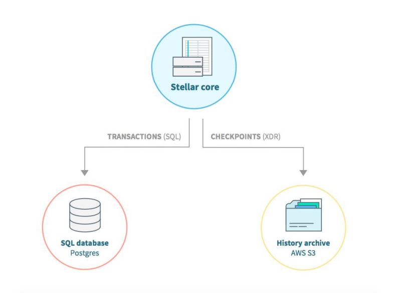
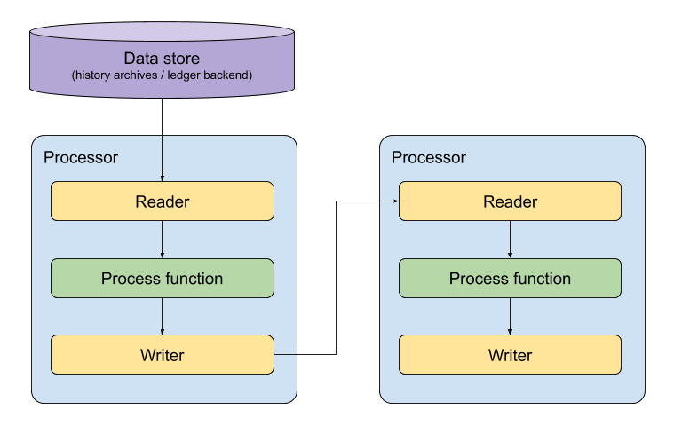
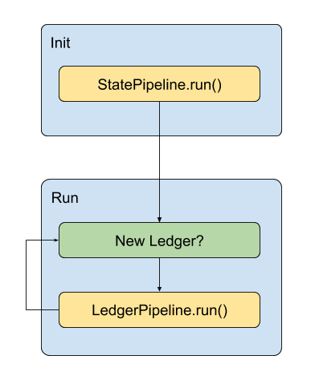
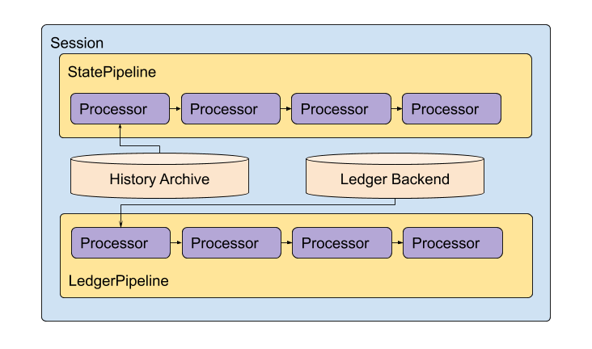

# Introduction

This guide is aimed at developers looking to understand Horizon’s new ingestion system. _Ingestion_ is a way of processing Stellar ledger data into developer-friendly forms. This system will eventually replace how Horizon currently acquires ledger data, and will ultimately form the basis for data for all of Horizon’s endpoints. 

The `ingest` package, which implements the Ingestion mechanisms described here, is also a standalone package that can be used to write custom applications or provide ledger data directly to an existing application.

This guide covers the general concepts around ingestion and explains how it works under the hood. After reading this guide you should have all the information you need to be able to code your first app using the `ingest` package.

## What is ingestion?

Stellar ledger data comes from two sources: history archives contain older state and a list of past transactions, while the ledger backend (currently the stellar-core database) contains the latest real-time data for transactions that were applied. These are described in more detail in the Data section below.

Ingestion is a process of transforming this low-level data into objects developers can use in their applications. This sounds simple, but the process is actually quite involved. For example, the [bucket list](https://github.com/stellar/stellar-core/tree/master/src/bucket) from the history archives is a complicated “set-of-sets-of-hashed-objects” and extracting objects for a single checkpoint ledger is not trivial. The new ingestion system provides useful structures to parse and stream objects for a given history checkpoint. It also provides all necessary primitives to easily develop a new pipeline that will produce results without thinking about low-level concepts.

## What was wrong with the previous ingestion system?

The previous ingestion system was part of the larger Horizon application. It was using the stellar-core database directly for all queries connected to state. This caused some serious issues connected to consistency, database size and some queries were affecting stellar-core’s performance. It was also almost impossible to use outside the Horizon context. Other problems included:

* No stable view. State queries were routed to stellar-core’s database, while transaction queries referenced Horizon’s own database, which could be a few ledgers behind.
* High load on stellar-core database. Certain complicated queries, such as deriving asset statistics, caused issues when sent to stellar-core’s database, sometimes causing it to become extremely slow and fall out of sync with the wider network.
* No filtering of data. If you just want to observe payments to a single account there’s no need to store the full ledger history, but this was not configurable.
* Not pluggable. It was not possible to toggle functions on or off. Everything was active, whether needed or not, and if a function didn’ texist, there was nothing that could be done.
* Huge space requirements. Recording all that data took terabytes of space.
* Requires Postgres DB. All data storage was implemented through Postgres. This was sub-optimal for certain functions like path-finding, which is much faster when implemented as an in-memory graph of offers.
* Slow development. The old ingestion code was hard to update, and tests were hard to write. In most cases this required writing/updating complex test scenarios; there were almost no unit tests.

# Main concepts

This section explains the main concepts of the new `ingest` package. We start by describing _readers_ and _writers_ and explaining why we need _streaming_. Then, we explain how to use readers and writers together in a _pipeline_. Finally, we explain what _sessions_ are and how pipelines can be useful in this context. 

## Data

Stellar ledger data used in the new ingestion package is drawn from two sources:
* History archives contain ledger state (ledger entries) and a list of past transactions.
* A ledger backend (currently stellar-core’s database) contains the latest real-time data for transactions that were applied.

### History Archives

During normal operation, a validating stellar-core server will save a "checkpoint" of its recent operations to XDR files, compress them, and publish them to all of its configured writable history archives once every 64 ledgers (about once every 5 minutes).

History checkpoints include the set of _buckets_ that have changed since the last checkpoint. Buckets contain the ledger entries of the Stellar ledger as well as the ledger headers, transaction sets, results of transactions, and a small amount of indexing metadata stored in JSON files.

In the context of the `ingest` package, history buckets are used primarily for constructing the state of a given checkpoint ledger. This decreases the client load on stellar-core’s database and allows the building of a consistent state that is updated as new transaction metadata becomes available.

### Ledger Backend

History checkpoints are only produced once every 64 ledgers. For real-time streaming of ledger data a Ledger Backend is needed. A Ledger Backend is an interface which provides two key functions:

1. Query the most recent ledger
2. Return all transaction data and ledger changes produced during a given ledger sequence

Using these two functions we can stream through all changes as they occur ledger by ledger. Note that at present Ledger Backend is implemented by connecting to stellar-core’s database and querying the database for ledger state. Thus for a Ledger Backend to be fully functional it must be paired with a stellar-core instance. The Ledger Backend is the only component in the new ingestion system which is coupled to stellar-core in this way. 

### Streaming: Readers

For a given ledger, the total size of the current state (all ledger entries) plus the transaction set can exceed typical RAM provisioning on popular hardware. Rather than restricting ingestion to high-end machines, the objects in the `ingest` package are streamed one by one. This saves memory and also makes the code easier to understand and reason about. For persistence, the data can also be incrementally stored to disk.

Readers can be found in the `ingest/io` package. They always implement two methods (and others depending on the type of the reader):
* `Read()` returns the next object or the error.
* `Close()` must be called when no more objects will be read from the reader. It allows the implementation to release temporary storage and shut down network connections.

#### MemoryStateReader

[`MemoryStateReader`](https://godoc.org/github.com/stellar/go/exp/ingest/io#MemoryStateReader) streams the ledger entries for a given checkpoint ledger. It abstracts the internal structure of buckets from the developer. When started it begins streaming ledger entries for a given ledger.

It’s worth noting that:
* Even though we stream objects there’s still a need to store some temporary objects used for processing. As of August 2019 it requires around 4GB of RAM to process the public network state.
* 3rd-party history buckets shouldn’t be trusted. `MemoryStateReader` has a built-in verification of buckets but requires a running stellar-core to compare bucket list hash in the ledger header.

#### DatabaseStateReader

`DatabaseStateReader` works exactly the same as `MemoryStateReader` but it stores temporary objects in database instead of memory. This largely decreases the memory requirements but also make the reader much slower.

#### DatabaseLedgerReader

`DatabaseLedgerReader` is responsible for streaming transactions read from stellar-core database. As explained in the previous sections this allows to fetch real-time transaction data. It can be surprising that one of the problems with the previous system was reading data from stellar-core database directly and we still do the same thing here. This is an open issue and we’re currently working with the stellar-core team on fixing this.

### Streaming: Writers

In the next section you’ll learn more about pipelines and how streaming is used there. Pipeline is a tree of processors passing object s from one processor to another. When an object is read we need a way to pass it to the next processor. That’s why we need writers.

Writers can be found in `ingest/io` package. They always implement two methods:
* `Write()` that writes an object to a temporary queue that will be read by the next processor.
* `Close()` that must be called when no more objects will be written. It allows the next processor to exit early knowing that no more objects will be passed to it.

What is interesting about writers is that you can create filters easily. Just read objects and write only the ones you’re interested in.

## Pipelines

An ingestion pipeline is modeled after a Unix pipe. It is represented by a tree of nodes. Data flows into the root node from one of the Streaming Readers described above. The root node performs some computation on the data which is read in from the Streaming Reader. The node can then pass off data from the Streaming Reader to a Streaming Writer. Alternatively, the node can filter away data before writing to the Streaming Writer, or, it may choose to not write anything at all to the Streaming Writer.

Whatever is written to the Streaming Writer will be read by all of the child nodes of the root node. Each child node will apply its own data transformations and can write data out to its own children. Eventually the data flow will eventually reach all terminal nodes (nodes which have no children) and at that point the ingestion pipeline will terminate.

Note that if an error occurs at any point in the pipeline tree then the entire pipeline terminates with an error. Because of this, it’s best to design pipelines to be idempotent so that they can be retried in case the pipeline encounters a transient error.

### Processors

Processors are nodes in the pipeline tree. The Processor interface consists of a Process function which takes a context, a pipeline store, a Streaming Reader, and a Streaming Writer. The context is used to signal early termination. The pipeline store provides a mechanism for storing and updating state which is shared by all the Processors. The Streaming Reader provides a stream of data which flows from the Processor’s parent. Whatever is written to the Streaming Writer will be fanned out to all the Processor’s children.

Note that the types for the Streaming Readers and the Streaming Writers must be the same. In other words, the data type of the objects returned by the Streaming Reader must match the data type of the objects written to the Streaming Writer.

### State Pipeline

A State Pipeline is an ingestion pipeline which operates on a history archive snapshot. The nodes in a State Pipeline implement the State Processor interface which is the same as a Processor interface described above except that they operate specifically on State Readers and State Writers. A State Pipeline will be fed the entire state of a Stellar Ledger at a particular sequence number. Because a State Pipeline needs to process the entirety of the Stellar Ledger it can take a long time to execute a State Pipeline.

### Ledger Pipeline

A Ledger Pipeline is an ingestion pipeline which operates on a more granular level than a State Pipeline. The Ledger Pipeline will be fed all the transactions and ledger changes which occur at a particular sequence number. In contrast to a State Pipeline, the execution of a Ledger Pipeline is relatively quick because it does not need to process any data from previous ledgers. The nodes in a Ledger Pipeline implement the Ledger Processor interface which is the same as a Processor interface described above except that they operate specifically on Ledger Readers and Ledger Writers.

### Global Pipeline (`support/pipeline` package)

The only difference between the State Pipeline interface and the Ledger Pipeline interface is that they operate on different types. The State Pipeline operates on State Readers and State Writers. The Ledger Pipeline operates on Ledger Readers and Ledger writers. If Golang had support for generics there would only be one Pipeline interface.

As a workaround for Golang’s lack of generics, there is a Pipeline implementation which operates on interface{} types. The State Pipeline and Ledger Pipeline implementations are built on top of the interface{} Pipeline implementation. This allows us to avoid code duplication in the Ledger and State Pipeline implementations because the bulk of the Pipeline implementation is centered around flowing data from the root node down to the leaves. The type of data which is passed between the nodes in the Pipeline tree are irrelevant.

## Sessions

Sessions implement common scenarios that users encounter processing ledger data. The main goal of Sessions is to hide implementation details from the end user and simplify running a scenario. In the following sections we will explain the _high/low resolution view_ and describe how the two sessions available in the `ingest` package work.

### Differences between Pipeline and Session

Pipelines orchestrate processors to form a linear flow of data in a tree. When processing is finished, a pipeline can be started again with a new reader.

On a contrary, Session orchestrate State Pipeline, Ledger Pipeline or both to work in a given way. Without Sessions developers would need to connect pipelines on their own, even though many of them ingest Stellar ledger data in the same way.

### High/Low Resolution View

We briefly explained history archives and ledger backends in the previous sections. In this section we want to focus more on the differences between the two and what use cases each store supports.

| x                             | Low Resolution (history archive) | High Resolution (ledger backend) |
|-------------------------------|----------------------------------|----------------------------------|
| Update frequency              | Every 64 ledgers (~5 minutes)    | Every ledger                     |
| Requires running stellar-core | No / Yes for hash verification   | Yes                              |
| Contains ledger state data    | Yes                              | No                               |
| Transaction metadata          | Aggregated (per checkpoint)      | Per transaction                  |

As you can see history buckets are updated less frequently. If you need real-time data you’ll probably use ledger backend. However, one powerful feature of history archives is that you don’t need to run stellar-core to get data. If you only need to update your data once in a while this can be a huge win. Next, you can rebuild the state using history buckets - it’s not possible using ledger backend. And finally, history buckets don’t contain per-transaction metadata (how ledger entries changed as a result of applying a transaction). They contain aggregated changes between checkpoints.

Here’s a simplified example (ignoring fees and sequence numbers): let’s say there are two transactions that happened between two checkpoint ledgers: 1) sending 1 XLM from A to B, 2) sending 1 XLM back from B to A. Both transactions metadata will contain ledger entry (account) changes however in the aggregated view there will be nothing because the final state is exactly the same.

You can read more about both views in the stellar-core repository: [Integration](https://github.com/stellar/stellar-core/blob/master/docs/integration.md).

### LiveSession

`LiveSession` consists of two steps:
* First, it processes the history buckets to rebuild the current state. Then it streams ledger entries to the state pipeline. 
* Second, it processes all the ledgers since the checkpoint ledger (using ledger backend) and continues using new ledgers fetched from ledger backend. The transactions data is streamed to ledger pipeline.

This session allows developers to build a state and update it using the real-time data. One of the use cases is updating the order book for a given market. First, we build the order book using offers found in the checkpoint ledger, then we update the order book as offers are added/updated/removed.

### SingleLedgerSession

`SingleLedgerSession` is used mostly for analytics connected to a single ledger. All it does is process the history buckets to rebuild the current state. The simple examples of using this session can be: finding all holders of a given asset, finding an average balance of a given asset, finding number of accounts/offers/trustlines at a given ledger.

### Other Sessions

Currently we implemented two sessions (explained above). Here are some other useful sessions that could be implemented:
* CheckpointSession - initialize the state using history archives and then update it when a new checkpoint appears (low resolution view).
* HourlyCheckpointSession - as above but update it every hour instead of each checkpoint (5 minutes).
* TransactionsOnlySession - process transaction data only (without state). Ex. to send email notification when account receives a payment.
* HistorySession - process data (state and/or transactions) between two dates in history, ex. to get some stats.
